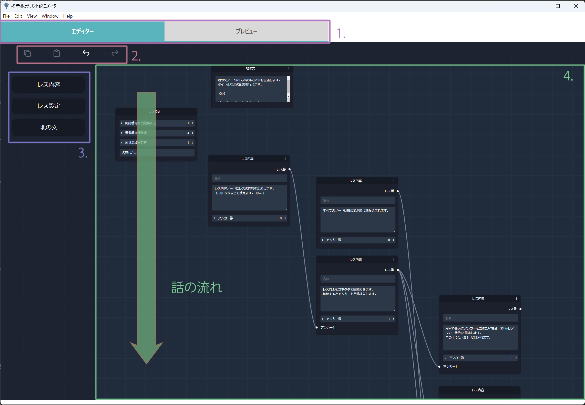
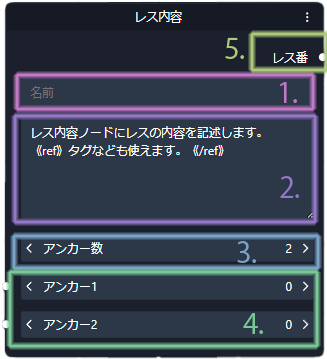
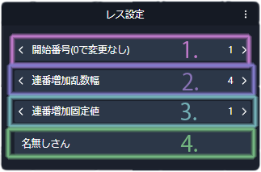
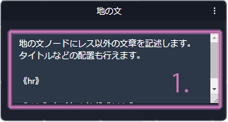
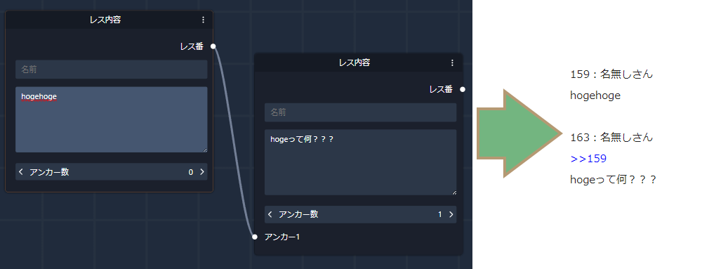
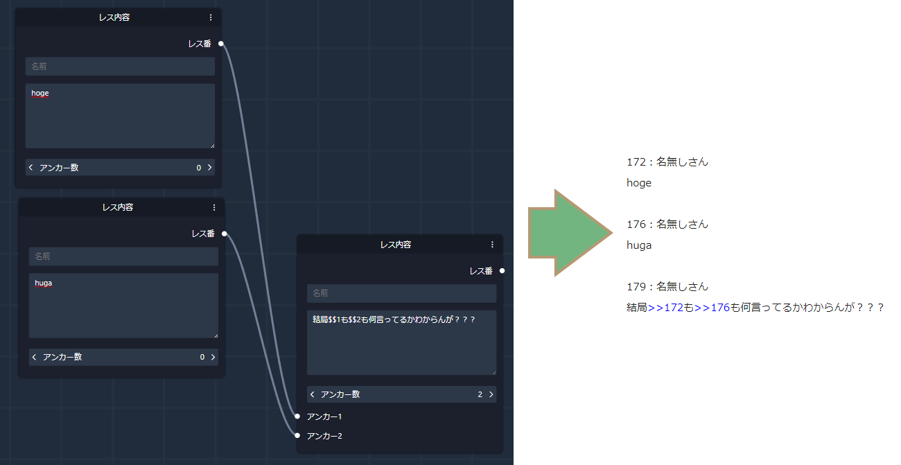
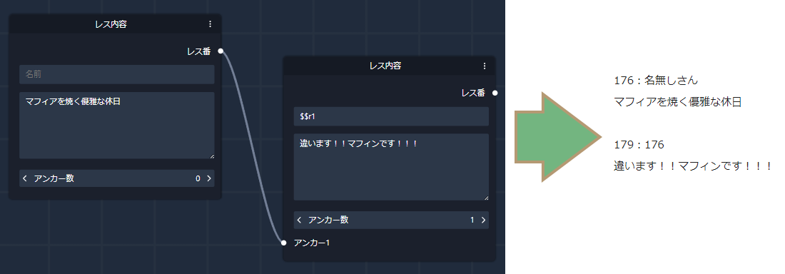
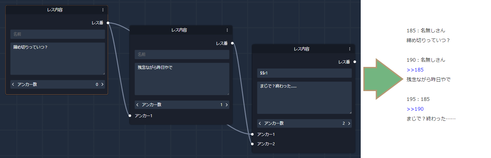

# ノードエディタ式掲示板形式小説エディタ


匿名掲示板やまとめサイトのような形式の掲示板形式小説(
  [参考:ハーメルンタグ検索](https://syosetu.org/search/?mode=search&word=%E6%8E%B2%E7%A4%BA%E6%9D%BF%E5%BD%A2%E5%BC%8F)
  )の執筆を補助するツールです。
ノードエディタのような操作でレス同士のつながりを記述するため、
実際のレス番号を記述することなく執筆でき、レスの追加・削除・順番変更が容易に行えます。<br>
現在は[ハーメルン](https://syosetu.org/)の掲示板形式のみに対応しております。

TODO:依頼中の動画が完成したらリンクを貼る

## 機能

- ノードを用いた掲示板形式小説の執筆
  - レス番号の自動附番(間隔など調整可能)
  - レスのつながりはノード同士をつなげることで表現、自動附番されたレス番に合わせてアンカーなどが自動挿入される
  - 地の文などレス以外の文章も配置可能

## 必要要件

- Windows環境
  - バイナリは用意できませんでしたが、Linux環境やMac環境でもビルドすれば動作するかもしれません……

## インストール

### Windows環境

releasesから最新のインストーラ(exe)をダウンロードして、画面の手順に従いインストールを行ってください。現在のユーザのみのインストールをお勧めします。

<details>
<summary>以下は手順未検証/動作未確認の内容です。十分な知識のもと行ってください。</summary>

### Mac環境/Linux環境

1. npmのインストールを行う
1. releasesからソースコードをダウンロードする
1. ソースコードを展開し、該当ディレクトリで以下を実行
```bash
npm install
npm run build
```
4. dist内の生成物(.dmg/.snap)を使用してインストールする？
</details>

## 使い方
### 画面の説明


#### 1.モード切り替えタブ
クリックでエディタ画面とプレビュー画面を切り替えます。

#### 2.編集ボタン
コピー(Ctrl+C)・ペースト(Ctrl+V)・アンドゥ(Ctrl+Z)・リドゥ(Ctrl+Y)が行えます。<br>
各ショートカットキーでも操作することができます。

#### 3.ノード挿入ボタン
エディタ画面に選択したノードを配置します。

#### 4.ノードエディタ
ここにノードを配置して掲示板形式小説の執筆を行います。<br>
配置したノードは上から下へ処理されるため、時系列が上から下へ流れるようにノードを配置して執筆します。<br>
マウスホイールで表示範囲の拡大・縮小を行えます。<br>
ノードに対して入力を行っていないとき(背景をクリックしたとき)にWASDキーを押すと表示範囲を移動させることができます。

### ノードの種類と説明
#### レス内容


レスの文章を記述します。
1. 名前<br>
   レスの発言者の名前を記述します。空白とした場合デフォルト名が自動挿入されます。アンカーを参照した表現が使用できます。（後述）
2. 内容<br>
   レスの内容を記述します。アンカーを参照した表現が使用できます。（後述）<br>
   右下の隅を掴んで入力フォームの大きさを調整できます。（ただし、大きさ調整の内容は保存されません。）
3. アンカー数<br>
   レスに接続できるノードの数を設定します。設定値を増減させると4.のポート数が増減します。<br>
   
4. アンカー<br>
   ここにレス番号を利用したいノードのレス番号を接続します。（後述）
5. レス番<br>
   このレスのレス番号を利用したいノードのアンカーに向けて接続します。（後述）

#### レス設定


レス番号の附番設定など、レスの設定を記述します。
この設定は本ノードより下のノードに適用され、次のレス設定ノードで上書きされるまで有効です。
1. 開始番号<br>
   レス設定の次にあるレス内容ノードのレス番号を固定値で指定します。
   開始する番号を変更したい場合・レス番号に大きく間隔を開けたい場合などに使用します。<br>
   0を指定した場合、次にあるレス内容ノードのレス番号は変更されません。
   番号はそのままで2.3.の設定のみを適用したい場合0を指定します。
2. 連番増加乱数幅<br>
   レス番号が増加する際の乱数幅を指定します。
3. 連番増加固定値<br>
   レス番号が増加する際の固定値を指定します。<br>
   2.3.を組み合わせてレス番号の増加度合いやばらつきを調節します。
4. デフォルト名<br>
   本ノードより下にあるレス内容ノードに対して、名前を特記しなかった場合に
   挿入されるデフォルト名を指定します。<br>
   指定しなかった場合、デフォルト名は変更されません。

#### 地の文


レス以外の文章を記述します。<br>
タイトル《xbig》や横線《hr》で装飾を行う際にも使用できます。
1. 内容<br>
   地の文や装飾などレス以外の文章の内容を記述します。<br>
   右下の隅を掴んで入力フォームの大きさを調整できます。（ただし、大きさ調整の内容は保存されません。）

### ノードの接続
レス内容ノード同士を接続することで、レス同士の関係性（レスに対する返信・同一の発言者など）を表現します。
- 単純な返信の場合、返信先のノードのレス番をアンカーに接続するだけで、内容の前にアンカーが自動挿入されます。
  
   

- 名前や内容にアンカーを組み込みたい場合、アンカーを組み込みたい場所に$$n(nは該当アンカーの番号)を記述します。
 
   

- 名前や内容にレス番号のみを組み込みたい場合、レス番号を組み込みたい場所に$$rn(nは該当アンカーの番号)を記述します。
 
   

- 接続されているが組み込みを行わなかったアンカーについては、内容の前にアンカーが自動挿入されます。上記の組み込みと返信を併用できるようなイメージです。
 
   


### 保存・読み込み
メニューからFile-Saveを選択すると、エディタの現在の内容を保存できます。
ノードの配置や内容・接続は保存されますが、各ノードの入力フォームのサイズ変更は保存されません。
自動保存機能やアプリを閉じる際の保存確認は現状ないため、こまめな保存をおすすめします。<br>
保存したファイルはメニューのFile-Openで読み込むことができます。


### プレビュー・エクスポート
プレビュータブをクリックしプレビュー画面を開くと、
ノードエディタの内容を掲示板形式に対応したテキストとしてプレビューします。<br>
メニューからFile-Exportを選択すると、ノードエディタの内容を掲示板形式に対応したテキストとしてファイル出力します。
出力完了後、既定のテキストエディタで出力されたファイルを開きます。

自動附番の都合上、プレビュー・エクスポートごとにレス番号が変化することがあるためご注意ください。
現在は[ハーメルン](https://syosetu.org/)の掲示板形式のみに対応しております。

## 作者
 
kanasam1677
 
## ライセンス
 
[MIT](https://github.com/kanasam1677/bbs-novel-node-editor/blob/master/LICENSE)</blockquote>